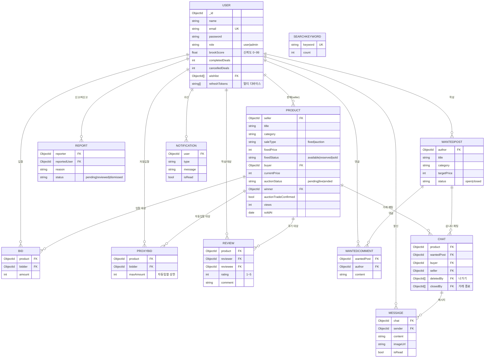

# Brook

중고 경매 & 즉시 판매 C2C 마켓플레이스

> 실시간 경매 입찰, 즉시 구매, 판매자-구매자 채팅을 지원하는 풀스택 중고 거래 플랫폼입니다.

---

## 목차

- [시연](#시연)
- [주요 기능](#주요-기능)
- [기술 스택](#기술-스택)
- [시스템 아키텍처](#시스템-아키텍처)
- [데이터 모델 (ERD)](#데이터-모델-erd)
- [핵심 구현 사항](#핵심-구현-사항)
- [기술적 의사결정 & 트레이드오프](#기술적-의사결정--트레이드오프)
- [트러블슈팅](#트러블슈팅)
- [환경 변수 설정](#환경-변수-설정)
- [실행 방법](#실행-방법)
- [API 명세](#api-명세)

---

## 시연

**배포 URL**: https://brook-sigma.vercel.app

### 시연 계정

| 역할 | 이메일 | 비밀번호 |
|------|--------|----------|
| 구매자 1 | buyer@brook-demo.com | Brook1234 |
| 구매자 2 | buyer2@brook-demo.com | Brook1234 |
| 판매자 | seller@brook-demo.com | Brook1234 |
| 관리자 | admin@brook-demo.com | Brook1234 |

> 구매자 2는 자동 입찰 등 **두 입찰자가 필요한 시나리오**용입니다.

### 주요 시나리오

**경매 시나리오**
1. 판매자 계정으로 로그인 → 상품 등록 (경매 타입)
2. 상품 상세 페이지에서 경매 시작 (시간 설정)
3. 구매자 계정으로 로그인 → 같은 상품 상세 페이지에서 입찰
4. 경매 종료 시 낙찰자에게 채팅방 자동 생성 및 알림 발송
5. 채팅방에서 판매자-구매자 실시간 대화

**자동 입찰 시나리오** (구매자 1 · 구매자 2 계정 사용)
1. 시작가 50,000원 경매에서 구매자 1이 자동 입찰 최대가 **100,000원** 설정 → 시작가로 선점
2. 구매자 2가 자동 입찰 최대가 **150,000원** 설정 → 구매자 2가 **110,000원**(상대 최대가 + 한 단위)에 자동 선점
3. 구매자 2는 150,000원을 다 내지 않고 필요한 만큼만 입찰 — 밀려난 구매자 1에게 자동 입찰 알림 발송

**대시보드 시나리오**
1. 판매자 계정 → 마이페이지 → "📊 판매 통계"
2. 총 매출·조회수·상태 분포·월별 매출·인기 상품 차트 확인

**즉시 구매 시나리오**
1. 판매자 계정으로 즉시판매 상품 등록
2. 구매자 계정으로 구매하기 → 채팅방 이동
3. 판매자가 거래 완료 처리 → 구매자 후기 작성

**관리자 시나리오**
1. 관리자 계정으로 로그인 → `/admin` 접근
2. 분석 탭에서 플랫폼 GMV·거래수·가입자 추이·카테고리 분포 차트 확인
3. 전체 사용자·상품·신고 관리, 경매 강제 종료
> 관리자 페이지는 프론트 라우트 가드 + 서버 `adminMiddleware` 이중 보호

---

## 주요 기능

### 경매
- 판매자가 경매 시작 시간·종료 시간을 직접 설정 (즉시 시작 / 예약 시작)
- 실시간 입찰 현황 및 남은 시간 카운트다운 (Socket.io)
- 입찰가 구간별 단위 자동 계산 (커스텀 설정 가능)
- **자동 입찰(proxy bidding)** — 최대가만 설정하면 eBay 방식으로 2등보다 한 단위씩만 자동 대리 입찰
- 유찰 시 즉시 판매로 자동 전환 옵션
- 서버 재시작 후 진행 중인 경매 타이머 자동 복구

### 즉시 판매
- 정가 구매 → 예약 → 거래 완료 단계별 상태 관리
- **판매자·구매자 양쪽 모두** 거래 완료(수령 확인) 처리 가능
- 예약/낙찰 후 일정 기간 미확정 시 양측에 거래 완료 리마인더 알림
- 거래 완료 후 후기 작성 가능

### 삽니다 (Wanted)
- 원하는 물품을 게시글로 등록, 판매자가 댓글로 응답
- 게시글 작성자가 댓글 작성자와 1:1 채팅 시작
- 목록에 댓글 수 표시

### 신뢰도 — 브룩 지수 (Brook Score)
- 후기 평점 · 거래 완료율 · 채팅 응답률 · 확인된 신고를 종합한 0~99점 신뢰도 지표
- 상품 상세 · 판매자 프로필 · 마이페이지에 시각화 (게이지 + 신뢰 등급)
- 거래 완료/취소, 후기, 신고 확인 시 실시간 재계산

### 신고
- 사기 의심·허위 상품·욕설 등 사유로 사용자 신고 ('기타' 선택 시 상세 필수)
- 7일 내 동일 사용자 중복 신고 차단
- 관리자가 확인/기각 처리 → 확인 시 브룩 지수 반영 + 신고자에게 결과 알림
- 마이페이지에서 내 신고 내역 조회

### 검색 · 추천
- 상품명 검색 + 카테고리·상태·가격대 필터·정렬 (URL 상태 동기화)
- **검색 자동완성** — 입력 시 구매 가능 상품명 실시간 제안 (디바운스)
- **인기 검색어** — 검색어를 집계해 검색창 포커스 시 TOP 노출
- **비슷한 상품 추천** — 상품 상세에 같은 카테고리·가격대 상품을 가격 근접도/조회수 기준으로 추천

### 데이터 · 분석
- **카테고리별 시세 분석** — 거래 완료 상품 기준 평균/최저/최고가, 상품 등록 시 적정가 안내
- **판매자 통계 대시보드** — 매출·조회수·상태 분포·월별 매출·인기 상품 차트 (recharts)
- **관리자 분석 대시보드** — 플랫폼 전체 GMV·거래수·신규 가입자 추이·카테고리 분포 차트

### 채팅
- 구매자-판매자 1:1 실시간 채팅 (Socket.io)
- 이미지 첨부, 읽음 표시, 미읽음 뱃지
- **나가기**(소프트 삭제, 상대가 메시지 보내면 다시 노출) / **양방향 거래 종료**(둘 다 동의 시 송수신 차단)

### 알림
- 입찰·낙찰·채팅·거래 완료·신고 처리 등 주요 이벤트 실시간 알림
- 헤더 알림벨 뱃지, 탭 포커스 시 자동 갱신

### 기타
- 상품 다중 이미지 업로드 (최대 5장, Cloudinary)
- 찜하기 / 찜 목록
- 판매자 프로필 (브룩 지수, 평균 별점, 거래 후기, 판매 상품)
- 관리자 페이지 (분석 대시보드, 사용자·상품·신고 관리, 경매 강제 종료)
- 멀티 디바이스 로그인 (기기별 Refresh Token 관리)

---

## 기술 스택

### 서버
| 항목 | 기술 |
|------|------|
| Runtime | Node.js |
| Framework | Express 5 |
| Database | MongoDB + Mongoose |
| 실시간 통신 | Socket.io |
| 인증 | JWT (Access Token 15분 + Refresh Token 7일, 멀티 디바이스) |
| 이미지 업로드 | Multer + Cloudinary |
| 보안 | bcrypt, express-rate-limit, CORS |
| 테스트 | node:test + supertest + mongodb-memory-server |

### 클라이언트
| 항목 | 기술 |
|------|------|
| Framework | React 19 |
| 빌드 도구 | Vite |
| 상태 관리 | Zustand |
| 스타일 | Tailwind CSS v4 |
| HTTP | Axios (인터셉터로 토큰 자동 갱신) |
| 실시간 통신 | Socket.io-client |
| 라우팅 | React Router v7 (라우트 단위 코드 스플리팅) |
| 차트 | Recharts |

### CI/CD
| 항목 | 기술 |
|------|------|
| CI | GitHub Actions (push/PR 시 lint · build · 테스트 · 문법 검사) |
| 배포 | Vercel (클라이언트) · Render (서버) |

---

## 시스템 아키텍처

```
┌─────────────────────────────────────────────────────┐
│                    Client (React)                    │
│                                                      │
│  Zustand Store ──── Axios Instance ──── Socket.io   │
│  (authStore)       (JWT interceptor)   (singleton)  │
└──────────────────────────┬──────────────────────────┘
                           │ HTTP / WebSocket
┌──────────────────────────▼──────────────────────────┐
│                  Server (Express 5)                  │
│                                                      │
│  REST API Routes ──── Middlewares ──── Socket.io    │
│                       (auth, admin,    (io → app)   │
│                        rate limit)                   │
└──────────────────────────┬──────────────────────────┘
                           │ Mongoose
┌──────────────────────────▼──────────────────────────┐
│                  MongoDB Atlas                       │
│  User / Product / Bid / ProxyBid / Chat / Message / │
│  Notification / Review / Report / WantedPost /      │
│  WantedComment / SearchKeyword                      │
└─────────────────────────────────────────────────────┘
                           │
              ┌────────────▼────────────┐
              │      Cloudinary         │
              │   (이미지 스토리지)       │
              └─────────────────────────┘
```

### 서버 구조
- `app.js`: Express 앱 설정 (라우트, 미들웨어, CORS)
- `server.js`: HTTP 서버 + Socket.io 초기화, MongoDB 연결
- `io` 인스턴스는 `app.set("io", io)` 로 주입 → 컨트롤러에서 `req.app.get("io")` 로 접근

### 경매 상태 머신
```
pending ──[판매자 시작]──▶ live ──[타이머 만료 / 수동 종료]──▶ ended
```
- 타이머는 서버 인메모리 `Map`으로 관리
- 서버 재시작 시 MongoDB에서 `auctionStatus: "live"` 상품을 조회해 타이머 재등록

### 클라이언트 인증 흐름
```
요청 발생
   │
   ▼
Axios 요청 인터셉터: localStorage에서 Access Token 헤더 삽입
   │
   ▼
응답 인터셉터: 401 응답 감지
   │
   ▼
Refresh Token으로 /api/auth/refresh 호출 → 새 토큰 저장
   │
   ▼
실패한 원본 요청 재시도
```

---

## 데이터 모델 (ERD)



> MongoDB(문서형)이므로 엄밀한 외래키 제약은 없지만, `ref` 기반 참조 관계를 ERD로 표현했습니다. 일부 관계(찜·deletedBy·closedBy)는 배열 참조입니다.

---

## 핵심 구현 사항

### 1. 동시 입찰 레이스 컨디션 방지

여러 사용자가 동시에 입찰할 때 데이터 정합성을 보장하기 위해 MongoDB의 원자적 업데이트를 사용했습니다.

```js
// 현재가 조건을 쿼리에 포함 → 다른 사람이 먼저 입찰하면 null 반환
const product = await Product.findOneAndUpdate(
  {
    _id: productId,
    auctionStatus: "live",
    currentPrice: { $lt: amount },  // 현재가보다 높을 때만 업데이트
  },
  { $set: { currentPrice: amount } },
  { new: true }
);

if (!product) {
  return res.status(409).json({ message: "다른 입찰자가 먼저 입찰했습니다." });
}
```

### 2. 경매 타이머 서버 재시작 복구

서버가 재시작되면 인메모리 타이머가 모두 사라지므로, MongoDB에서 진행 중인 경매를 조회해 타이머를 재등록합니다. 이미 종료 시각이 지난 경매는 즉시 `finalizeAuction`을 실행합니다.

```js
// server.js - MongoDB 연결 직후 실행
await restoreAuctionTimers();
```

### 3. JWT 액세스 토큰 자동 갱신

Axios 응답 인터셉터에서 401 에러를 감지하면 Refresh Token으로 새 토큰을 발급받고, 실패한 요청을 자동으로 재시도합니다. 갱신 중 중복 요청이 들어오면 동일한 갱신 프로미스를 공유해 토큰이 두 번 갱신되는 것을 방지합니다.

### 4. Socket.io 룸 기반 이벤트 격리

경매별·채팅방별 룸을 사용해 관련 사용자에게만 이벤트를 전송합니다.

```
auction:<productId>  — 경매 입찰·시작·종료 이벤트
chat:<chatId>        — 채팅 메시지·종료 이벤트
user:<userId>        — 개인 알림 이벤트
```

### 5. URL 상태 동기화 필터링

검색·필터·정렬·페이지 상태를 `useSearchParams`로 URL에 동기화합니다. 뒤로가기 시 필터 상태가 유지되고, 링크 공유가 가능합니다.

### 6. 자동 입찰 (eBay 방식 proxy bidding)

입찰자는 **최대 금액(상한선)** 만 설정하고, 시스템이 2등보다 한 단위만 높게 자동으로 대리 입찰합니다. 입찰자별 "유효 최대치"(자동 입찰 상한 또는 마지막 수동 입찰가 중 큰 값)를 비교해 최고가 보유자를 리더로 정하고, 가격은 **2등 최대치 + 입찰 단위**(자기 상한 한도)로만 올립니다.

```js
// 입찰가 = min(내 최대가, 2등 최대가 + 입찰단위)
const [winnerId, winnerMax] = entries[0];
const second = entries[1];
const unit = getBidUnit(second.max, product.bidTiers);
const newPrice = Math.min(winnerMax, second.max + unit);
```

수동 입찰이 들어온 직후에도 기존 자동 입찰이 즉시 재정산되어, 한도 내에서 자동으로 재선점합니다. (예: A 최대 10만 / B 최대 15만 → B가 **11만**에 선점, 15만을 다 내지 않음)

### 7. 신뢰도 지표 — 브룩 지수

후기 평점, 거래 완료율, 채팅 응답률, 확인된 신고를 가중 합산해 0~99점의 신뢰도를 산출합니다. 거래 완료/취소, 후기 작성, 신고 확인 등 신뢰에 영향을 주는 이벤트가 발생할 때마다 재계산합니다.

- 완료율은 **종결된 거래(완료+취소) 기준** — 진행 중 거래가 점수를 깎지 않도록 설계
- 신고 패널티는 별도 카운터 없이 `Report` 컬렉션을 직접 집계 → 단일 진실 소스

### 8. 판매자 대시보드 단일 쿼리 집계

`$facet` 파이프라인으로 요약 통계·상태 분포·월별 매출·인기 상품을 **한 번의 집계 쿼리**로 산출합니다. `$addFields`로 판매 여부·활성 여부·최종가를 선계산한 뒤 여러 그룹 연산을 병렬 수행합니다.

```js
{ $facet: {
    summary:        [ { $group: { _id: null, totalRevenue: ..., soldCount: ..., totalViews: ... } } ],
    statusBreakdown:[ /* 상태별 개수 */ ],
    salesByMonth:   [ /* soldAt 기준 월별 매출 */ ],
    topViewed:      [ { $sort: { views: -1 } }, { $limit: 5 } ],
} }
```

### 9. 검색 자동완성 · 인기 검색어 · 추천

검색창 입력을 디바운스해 구매 가능한 상품명을 자동완성으로 제안하고, 새 검색마다 `SearchKeyword` 컬렉션에 검색어를 집계해 인기 검색어를 산출합니다. 상품 상세에서는 같은 카테고리 상품을 **가격 근접도 → 조회수** 순으로 정렬해 비슷한 상품을 추천하는 콘텐츠 기반 추천을 제공합니다.

### 10. 테스트 & 빌드 게이트

`node:test` + `supertest` + `mongodb-memory-server`(레플리카셋, 트랜잭션 지원)로 인증·거래 완료·자동 입찰·채팅·브룩 지수·신고·시세·대시보드·검색·추천 등 핵심 플로우를 **41개** 테스트로 검증합니다 (`npm run test:coverage`로 커버리지 측정). GitHub Actions가 push/PR마다 클라이언트 lint·build와 서버 테스트·문법 검사를 실행해, 깨진 코드가 배포되는 것을 차단합니다.

---

## 기술적 의사결정 & 트레이드오프

### 자동 입찰을 외부 라이브러리 없이 직접 구현

**결정**: eBay식 proxy bidding(2등 최대가 + 한 단위 정산)을 `settleProxyBids` 정산 함수로 직접 구현.
**이유**: 입찰 도메인 로직은 비즈니스 핵심이라 외부 의존성에 묶이기보다 직접 제어하는 게 명확하고, 입찰 단위(`bidTiers`)·동시성 등 우리 규칙과 맞물려야 했습니다.
**트레이드오프**: 직접 구현해 정산/동시성 엣지 케이스를 직접 책임져야 함 → 단위 테스트(단독 선점·수동 대응·2자 경쟁)로 보완.

### 토큰을 localStorage에 저장 (vs httpOnly 쿠키)

**결정**: Access/Refresh 토큰을 localStorage에 저장하고 Axios 인터셉터로 헤더 주입.
**이유**: 프론트(Vercel)·백엔드(Render) 도메인이 달라 크로스 사이트 쿠키 설정이 복잡하고, CSRF 방어라는 새 과제가 생깁니다. JSX 자동 이스케이프 + HTML 직접 렌더 부재로 XSS 표면이 작고, Access 토큰 수명을 15분으로 짧게 둬 위험을 완화.
**트레이드오프**: XSS가 발생하면 토큰 탈취 위험. 운영 트래픽이 큰 서비스라면 Refresh 토큰을 httpOnly 쿠키로 옮기는 것이 정석.

### 신뢰도(브룩 지수)를 Report 컬렉션에서 직접 집계

**결정**: 신고 패널티를 `user.reportCount` 같은 비정규화 카운터 대신 `Report.countDocuments({ status: "reviewed" })`로 매 계산 시 집계.
**이유**: 카운터를 따로 두면 상태 변경 시 동기화가 깨질 수 있어, **단일 진실 소스(Report 컬렉션)**로 통일.
**트레이드오프**: 계산 시 집계 쿼리 1회 추가. 신뢰도 재계산은 빈번하지 않아 비용보다 정합성 이점이 큼.

### 대시보드 통계를 `$facet` 단일 쿼리로

**결정**: 요약·상태 분포·월별 매출·인기 상품을 `$facet`으로 한 번에 집계.
**이유**: 라운드트립을 줄이고, `$addFields`로 판매 여부·최종가를 선계산해 여러 그룹 연산을 공유.
**트레이드오프**: 파이프라인이 길어져 가독성↓ → 주석과 단계 분리로 보완.

### 경매 타이머: 인메모리 + 재시작 복구 (vs 잡 큐)

**결정**: `setTimeout`을 인메모리 `Map`으로 관리하고, 서버 시작 시 DB에서 진행 중 경매를 조회해 타이머 재등록.
**이유**: Redis/잡 큐 도입은 인프라 복잡도가 큼. 단일 서버 규모에선 인메모리 + 부팅 복구로 충분.
**트레이드오프**: 다중 인스턴스로 수평 확장 시엔 중앙 스케줄러(예: BullMQ)가 필요.

### 동시 입찰: 원자적 `findOneAndUpdate` (vs 트랜잭션/락)

**결정**: 현재가 비교 조건을 쿼리에 포함한 단일 원자 연산으로 단 하나의 입찰만 통과.
**이유**: 명시적 락 없이 DB 레벨에서 경쟁 조건(TOCTOU)을 차단해 간결하고 빠름.
**트레이드오프**: 실패한 입찰은 409로 재시도 유도 → 사용자에게 현재가 재확인을 요청.

### 채팅: 소프트 나가기(deletedBy) + 양방향 종료(closedBy) 분리

**결정**: "나가기"는 목록에서만 숨기고 상대가 메시지를 보내면 재노출, "거래 종료"는 양쪽 동의 시 송수신 차단으로 분리.
**이유**: 단일 `isActive` 플래그로는 "보관함식 숨김"과 "완전 종료"를 동시에 표현할 수 없었음.
**트레이드오프**: 상태 필드가 2개로 늘어 로직이 복잡 → 흐름별 테스트로 보강.

---

## 트러블슈팅

### ESM 환경에서 dotenv 초기화 순서 문제

**문제**: `import "dotenv/config"` 를 `server.js` 최상단에 선언했음에도, 다른 모듈에서 `process.env` 가 `undefined` 로 읽히는 현상 발생.

**원인**: ES Module은 모든 `import` 구문을 먼저 평가(호이스팅)한 뒤 코드를 실행합니다. 따라서 `dotenv.config()` 를 함수 호출 방식으로 쓰면, 다른 모듈들이 import될 때는 아직 환경 변수가 로드되지 않은 상태입니다.

**해결**: `import "dotenv/config"` 사이드 이펙트 import 방식으로 변경. 이 방식은 모듈 평가 시점에 실행되므로, 이후 import되는 모든 모듈에서 환경 변수를 정상적으로 참조할 수 있습니다.

---

### 동시 입찰 시 데이터 정합성 문제

**문제**: 두 사용자가 거의 동시에 같은 금액으로 입찰했을 때, 두 입찰 모두 성공으로 처리되어 중복 낙찰이 발생할 수 있었음.

**원인**: `find` → 검증 → `update` 로직 사이에 다른 요청이 끼어들 수 있는 TOCTOU(Time-Of-Check-Time-Of-Use) 문제.

**해결**: `findOneAndUpdate`의 조건 절에 현재가 비교 로직을 포함시켜 원자적 연산으로 처리. DB 레벨에서 단 하나의 요청만 성공하도록 보장.

---

### 서버 재시작 후 경매 타이머 소실

**문제**: 서버가 재시작되면 인메모리에 저장된 `setTimeout` 타이머가 모두 사라져, 진행 중이던 경매가 영구적으로 멈추는 현상.

**원인**: Node.js 프로세스의 인메모리 상태는 재시작 시 초기화됨.

**해결**: 서버 시작 시 MongoDB에서 `auctionStatus: "live"` 상품을 조회해 남은 시간을 계산하고 타이머를 재등록. 이미 종료 시각이 지난 경매는 즉시 낙찰 처리.

---

## 환경 변수 설정

### `server/.env`
```env
PORT=5000
MONGODB_URI=mongodb+srv://...
JWT_SECRET=your_jwt_secret
JWT_REFRESH_SECRET=your_refresh_secret
CLIENT_URL=http://localhost:5173
CLOUDINARY_CLOUD_NAME=your_cloud_name
CLOUDINARY_API_KEY=your_api_key
CLOUDINARY_API_SECRET=your_api_secret
```

### `client/.env`
```env
VITE_API_BASE_URL=http://localhost:5000
```

---

## 실행 방법

```bash
# 서버
cd server
npm install
npm run dev

# 클라이언트 (별도 터미널)
cd client
npm install
npm run dev
```

클라이언트: http://localhost:5173  
서버: http://localhost:5000

### 데모 데이터 시드

```bash
cd server
npm run seed
```

현실적인 더미 데이터(유저·상품·입찰·후기·검색 기록)를 생성해 대시보드·추천·시세·인기 검색어가 바로 채워집니다. 데모 계정 4종도 함께 생성됩니다.
> ⚠️ 기존 User/Product/Bid/Review/SearchKeyword 데이터를 삭제 후 재생성합니다.

### 테스트

```bash
cd server
npm test
```

---

## API 명세

### 인증 `POST /api/auth`
| 메서드 | 경로 | 설명 |
|--------|------|------|
| POST | `/register` | 회원가입 |
| POST | `/login` | 로그인 (Access + Refresh Token 발급) |
| POST | `/refresh` | Access Token 갱신 |
| POST | `/logout` | 로그아웃 (Refresh Token 무효화) |
| GET | `/me` | 내 정보 조회 |

### 상품 `GET /api/products`
| 메서드 | 경로 | 설명 |
|--------|------|------|
| GET | `/` | 상품 목록 (검색·필터·정렬·페이지네이션) |
| GET | `/price-stats?category=` | 카테고리별 시세 통계 |
| GET | `/suggestions?q=` | 검색 자동완성 제안 |
| GET | `/popular-searches` | 인기 검색어 |
| POST | `/` | 상품 등록 |
| GET | `/:id` | 상품 상세 |
| GET | `/:id/recommendations` | 비슷한 상품 추천 |
| PATCH | `/:id` | 상품 수정 |
| DELETE | `/:id` | 상품 삭제 (연관 채팅·입찰·찜 정리) |
| POST | `/:id/purchase` | 즉시 구매 |
| POST | `/:id/confirm` | 즉시구매 거래 완료 (판매자/구매자) |
| POST | `/:id/confirm-auction` | 경매 거래 완료 (판매자/낙찰자) |
| POST | `/:id/cancel` | 예약 취소 |

### 경매 `/api/auctions`
| 메서드 | 경로 | 설명 |
|--------|------|------|
| POST | `/:productId/start` | 경매 즉시 시작 |
| POST | `/:productId/schedule` | 경매 예약 시작 |
| DELETE | `/:productId/schedule` | 경매 예약 취소 |
| POST | `/:productId/bid` | 입찰 |
| POST | `/:productId/auto-bid` | 자동 입찰(최대가) 설정 |
| GET | `/:productId/auto-bid` | 내 자동 입찰 설정 조회 |
| POST | `/:productId/end` | 경매 수동 종료 |
| GET | `/:productId/bids` | 입찰 내역 조회 |

### 채팅 `/api/chats`
| 메서드 | 경로 | 설명 |
|--------|------|------|
| GET | `/` | 내 채팅 목록 |
| POST | `/` | 채팅방 생성 |
| GET | `/:chatId` | 채팅방 정보 |
| GET | `/:chatId/messages` | 메시지 목록 |
| POST | `/:chatId/messages` | 메시지 전송 |
| DELETE | `/:chatId` | 채팅방 나가기 (소프트 삭제) |
| POST | `/:chatId/close` | 거래 종료 요청 (양방향) |

### 사용자 `/api/users`
| 메서드 | 경로 | 설명 |
|--------|------|------|
| GET | `/me/products` | 내 판매 상품 |
| GET | `/me/bids` | 내 입찰 내역 |
| GET | `/me/wins` | 낙찰 상품 |
| GET | `/me/wishlist` | 찜 목록 |
| POST | `/me/wishlist/:productId` | 찜 토글 |
| GET | `/me/dashboard` | 판매자 통계 대시보드 |
| GET | `/:userId` | 판매자 프로필 (브룩 지수 포함) |

### 후기 `/api/reviews`
| 메서드 | 경로 | 설명 |
|--------|------|------|
| POST | `/` | 후기 작성 |
| GET | `/product/:productId` | 상품 후기 목록 |
| GET | `/user/:userId` | 판매자 후기 목록 + 평균 별점 |

### 신고 `/api/reports`
| 메서드 | 경로 | 설명 |
|--------|------|------|
| POST | `/` | 사용자 신고 |
| GET | `/me` | 내 신고 내역 |
| GET | `/` | 전체 신고 목록 (관리자) |
| PATCH | `/:reportId` | 신고 처리 — 확인/기각 (관리자) |

### 삽니다 `/api/wanted`
| 메서드 | 경로 | 설명 |
|--------|------|------|
| GET | `/` | 삽니다 게시글 목록 |
| POST | `/` | 게시글 작성 |
| GET | `/:id` | 게시글 상세 |
| PATCH | `/:id` | 게시글 수정 |
| DELETE | `/:id` | 게시글 삭제 (연관 댓글·채팅 정리) |
| POST | `/:id/comments` | 댓글 작성 |
| GET | `/my` | 내 게시글 |
| GET | `/my-comments` | 내가 댓글 단 게시글 |

### 관리자 `/api/admin` (adminMiddleware)
| 메서드 | 경로 | 설명 |
|--------|------|------|
| GET | `/analytics` | 플랫폼 분석 (GMV·거래수·가입자 추이·카테고리 분포) |
| GET | `/users` | 전체 사용자 |
| DELETE | `/users/:userId` | 사용자 삭제 |
| GET | `/products` | 전체 상품 |
| DELETE | `/products/:productId` | 상품 강제 삭제 |
| POST | `/products/:productId/end-auction` | 경매 강제 종료 |
| GET | `/wanted` | 전체 삽니다 게시글 |
